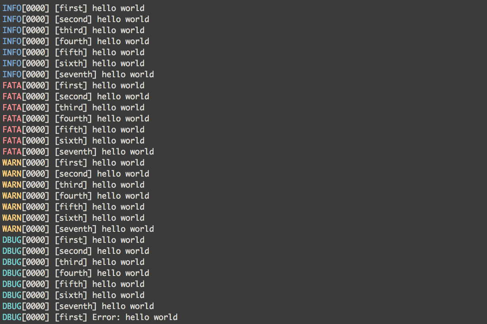

# ndjson-logrus
[![NPM version][npm-image]][npm-url]
[![build status][travis-image]][travis-url]
[![Test coverage][coveralls-image]][coveralls-url]
[![Downloads][downloads-image]][downloads-url]

[logrus](https://github.com/Sirupsen/ndjson-logrus) style log formatter.
Takes in [ndjson][ndj] and makes it pretty.

## Installation
```bash
$ npm install ndjson-logrus
```

## Usage
```sh
node server.js | ndjson-logrus
```


## See Also
- [bole](https://github.com/rvagg/bole) - modular logger
- [debug-to-json](https://github.com/yoshuawuyts/debug-to-json) - transforms [debug](http://ghub.io/debug) output to [ndjson][ndj]
- [bistre](https://ghub.io/bistre) - alternative ndjson log interpreter

## Thanks
- [hughsk](https://github.com/hughsk) - for writing [bistre](http://ghub.io/bistre) on which this module is based.

## License
[MIT](https://tldrlegal.com/license/mit-license)

[npm-image]: https://img.shields.io/npm/v/ndjson-logrus.svg?style=flat-square
[npm-url]: https://npmjs.org/package/ndjson-logrus
[travis-image]: https://img.shields.io/travis/yoshuawuyts/ndjson-logrus.svg?style=flat-square
[travis-url]: https://travis-ci.org/yoshuawuyts/ndjson-logrus
[coveralls-image]: https://img.shields.io/coveralls/yoshuawuyts/ndjson-logrus.svg?style=flat-square
[coveralls-url]: https://coveralls.io/r/yoshuawuyts/ndjson-logrus?branch=master
[downloads-image]: http://img.shields.io/npm/dm/ndjson-logrus.svg?style=flat-square
[downloads-url]: https://npmjs.org/package/ndjson-logrus

[ndj]: http://ndjson.org/
